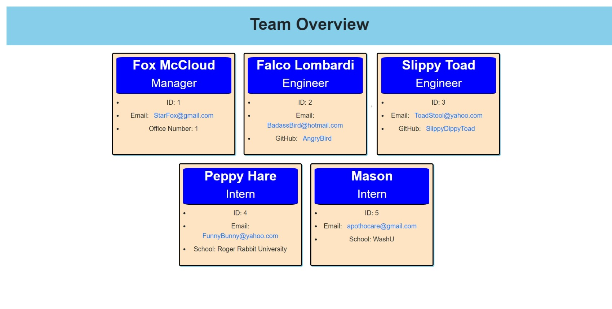

# Team-Show-and-Tell
[]
# Description
a Node.js command-line application that takes in information about employees on a software engineering team and generates an HTML webpage that displays summaries for each person. 

(https://drive.google.com/file/d/1B_CvY9zPRg4pUacgPJDGvSKAUjAOHu4R/view "team-show-and-tell Walkthrough")
# Table of Contents
* [Installation](#installation)
* [Usage](#usage)
* [License](#license)
* [Contributing](#contributing)
* [Questions](#questions)
# Installation
The following necessary dependencies must be installed to run the application
# Usage
In order to use this app, Install required packages and type "node index.js" in terminal. Follow all prompts. HTML page will be generated after prompts are complete
# License
This project is licensed under the MIT License license.
# Contributing
Contributors: Tyler Mason (JayWhiteBuffalo)
# Tests
Testing is listed in "___tests___" folder found at the GithubRepo
# Questions
If you have any questions, contact:

 JayWhiteBuffalo@protonmail.com

 Link to GitHub:

https://github.com/JayWhiteBuffalo
